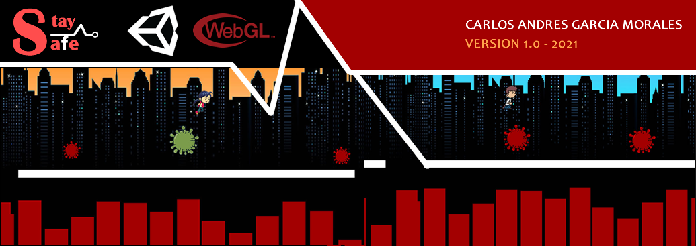

## Description

Stay Safe is a simple Jumping game, where girl/boy must stay as many days as possible without being infected by the Covid-19 virus.

### CONTROLS

Press Space to jump
Press Space to restart (if you lost)
Press Escape to Main Menu (if you lost)

**IMPORTANT** This project has no commercial purpose and I do not intend to take away the legal right to the content or image of any brand, it is only a project made with love and with the purpose of improving my Unity engine skills.

## Features: 

### Version: 1.0
- Main menu with 2 characters to choose.
- Stage for girl
- Stage for Boy.
- Jump function.
- Enemies implemented(Covid-19).
- Lose function implemented.
- Restart Stage option implemented. (key space).
- Go Back to main Menu implemented. (key Escape).
- days counter implemented (score).
- Support for Google Chrome, Firefox, Microsoft Edge (Recommended PC browser).

## Access Link

[Play Game](https://agzsoftsi.itch.io/stay-save)

## Technologies:

- HTML5
- Unity2D v 2019.4.31f1(64bit)
- C#
- WebGL

## Video DEMO

[DEMO]()

## :sagittarius: Author

> :man: Carlos Andres Garcia Morales

> :e-mail: [E-mail](agzsoftsi@gmail.com)

> :octocat: [Github](https://github.com/agzsoftsi)

> :bird: [Twiiter](https://twitter.com/karlgarmor)

> :blue_book: [Linkedin](https://twitter.com/karlgarmor)

> :globe_with_meridians: [WebPage](https://agzsoftsi.github.io/Portafolio/)